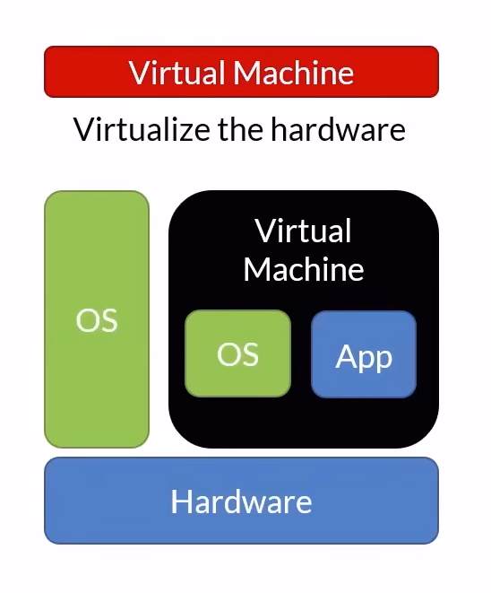
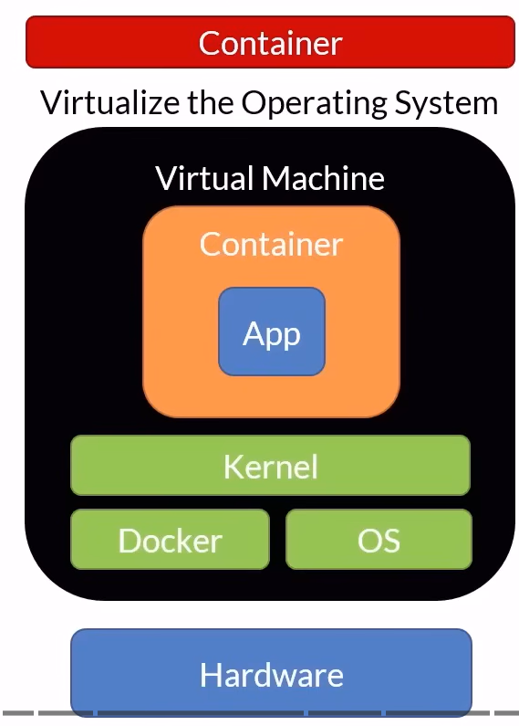

## What is container?

- A unit of software/deployment including code, runtime, system tools and libraries

## Why containers?

- Faster by deploying small units
- Use fewer resources
- Fit more into same host
- Faster automation
- Portability
- Isolation

## VMs vs Container?

### VM

=>
- Large footprint
- Slow to boot
- Ideal for long running tasks

### Container

=>
- Lightweight
- Quick to start
- Portable
- Ideal for short lived tasks

## Container registry
- Centralized container repository (Github for containers) 

## Orchestrator
- Manage
    - Infrastructure
    - Containers
    - Deployment
    - Scaling
    - Failover
    - Health monitoring
    - App upgrades, 0-Downtime Deployment
- Install your own
    - Kubernetes, Swarm, Service Fabric
- Orchestrator as service
    - Azure Kubernetes Service, Service Fabric