## What is Docker?
- Open-source container runtime
- Support Mac, Window & Linux
- Dockerfile file format for building container images
- Windows let you run Windows and Linux containers

## Management Commands

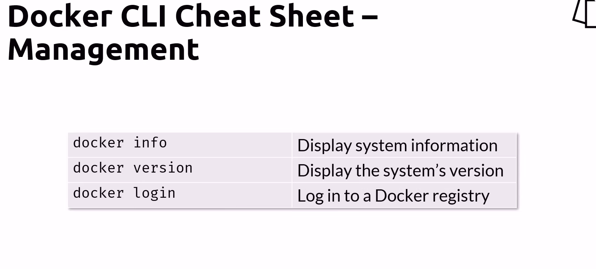

## Running & Stopping Commands
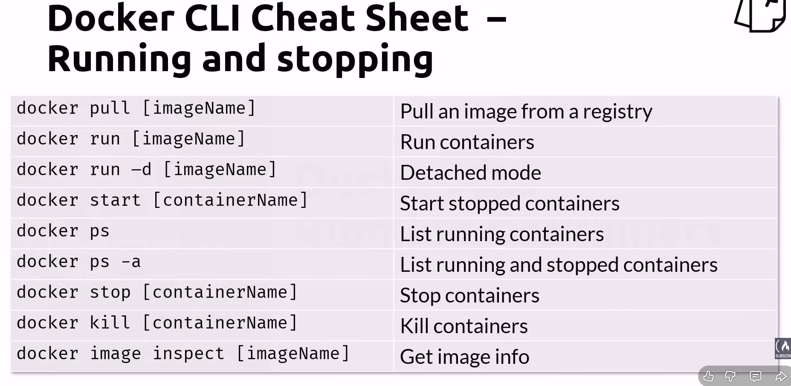

```!Notes:```
1. Command Notes

    | Command  | Note     |
    |----------|----------|
    |``docker run -d [imageName]``    | Run containers in the background   | 
    |``docker stop [containerName]``    | Stop containers (They are still in memory)   | 
    |``docker kill [containerName]``    | Kill containers (If they might be stucked in the memory)   | 


2. Image Name vs Container Name
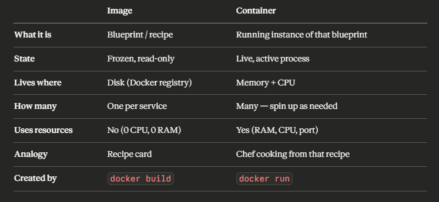

## Limits Commands
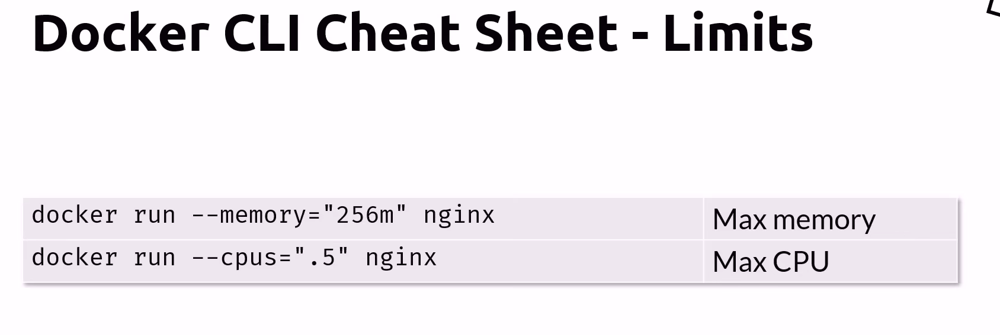

## Running Containers
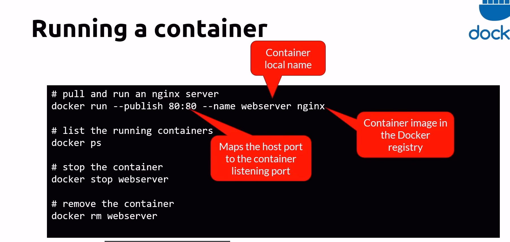

## Attach Shell Commands
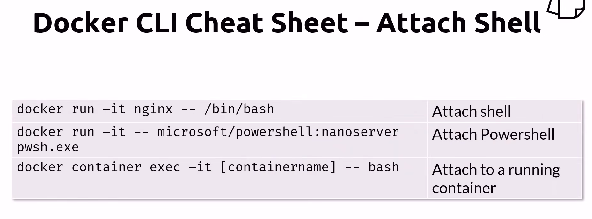

## Cleaning Up Commands
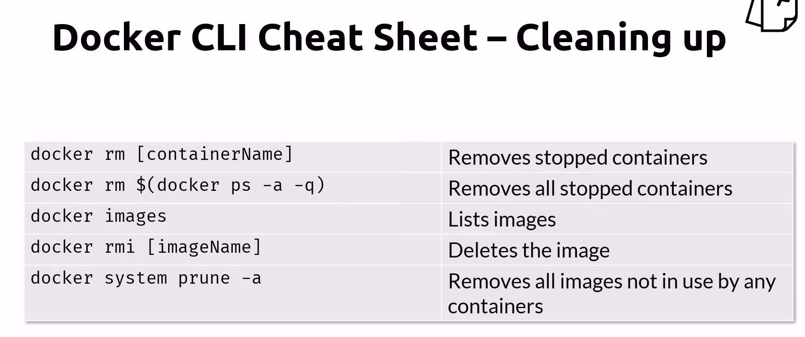

```!Notes:```
1. Command Notes

    | Command  | Note     |
    |----------|----------|
    |``docker rm [containerName]``    | Remove containers in mem (containers must be stopped state)   | 

## Building Containers Commands
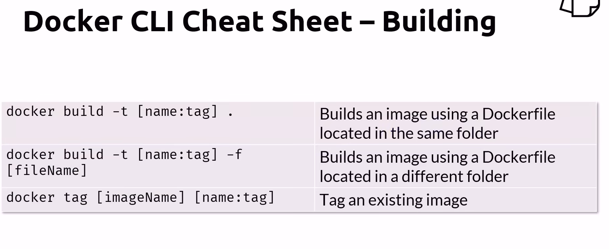

```!Notes:```

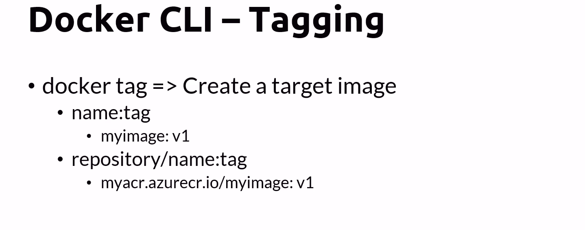
[name:tag]: tag usually used to specify version number

### Example
1. Dockerfile -static HTML site
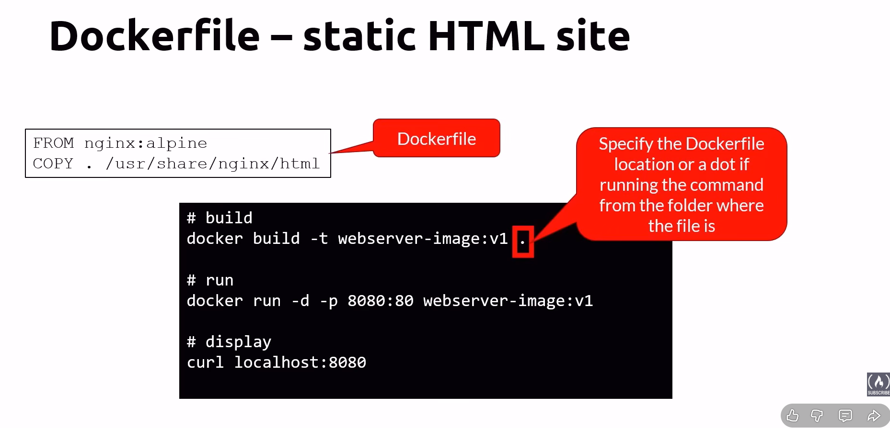

2. Dockerfile - Node Site
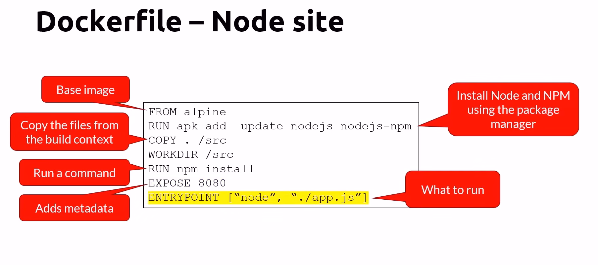