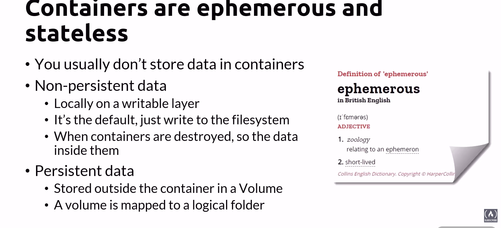
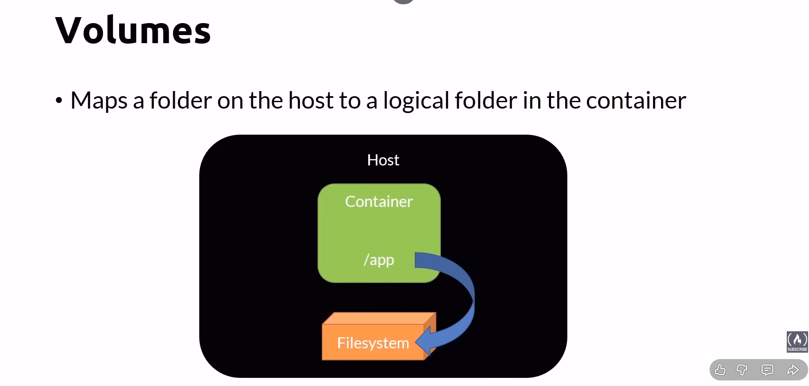
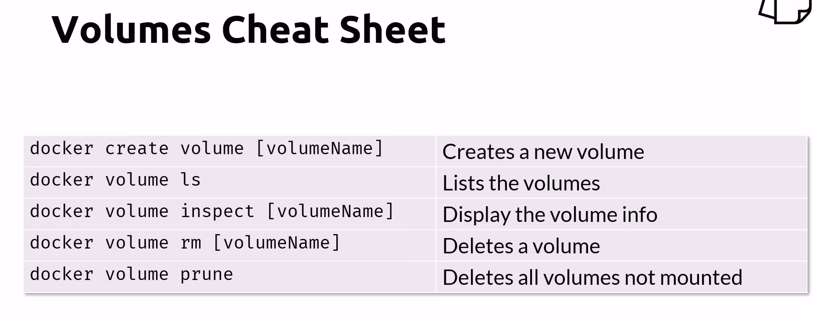
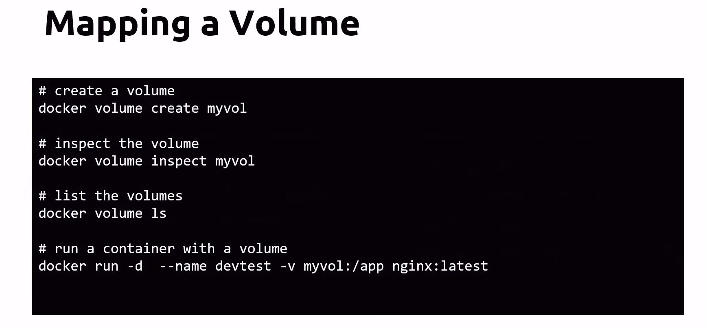
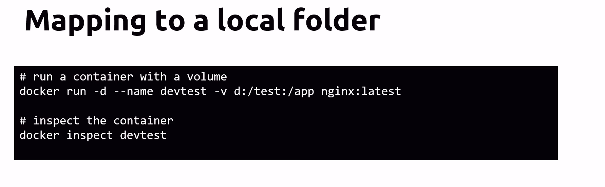

## Container are stateless


## Volumes


```!Notes:```
-  The  local folder is map to  VM file system => data is store inside the volume  => data survive when container restart or crash
- There is still chance of losing data if the VM crashes


## Volume Commands


## Mapping a Volume


## Mapping to local folder


```!Notes:```
- Don't use in production