## Docker Compose
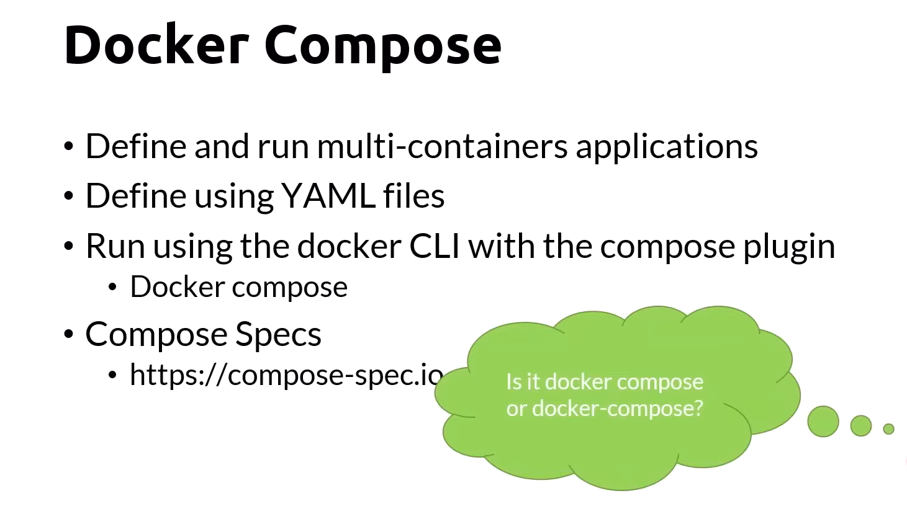

## Docker Compose File Example
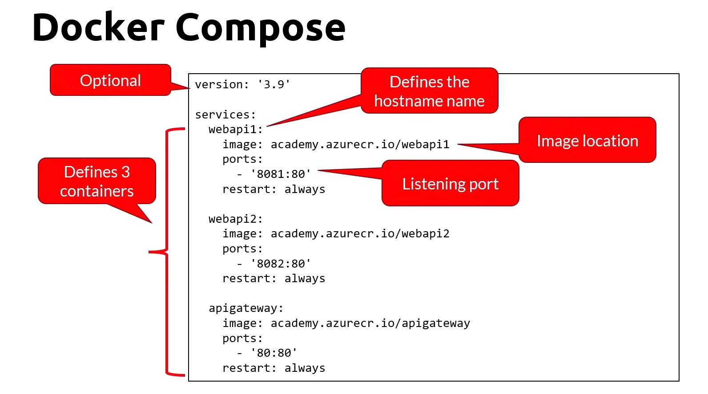

## Usage
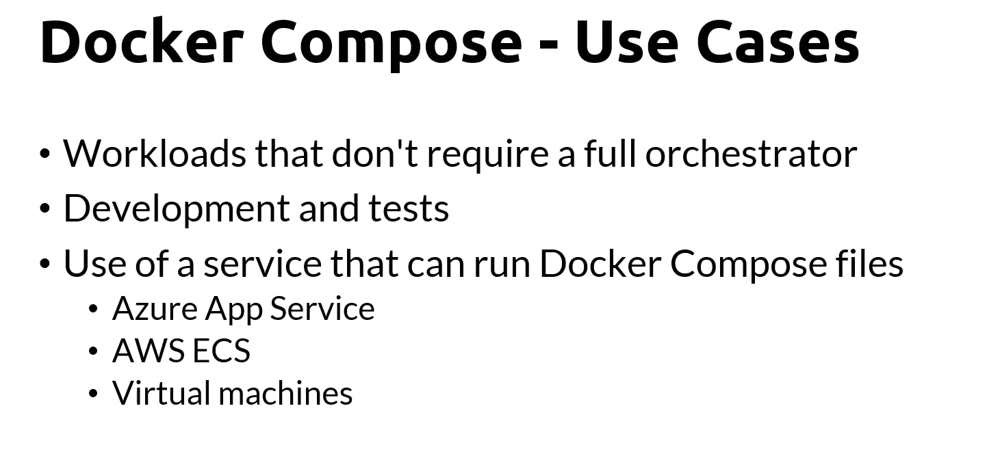

## Docker CLI
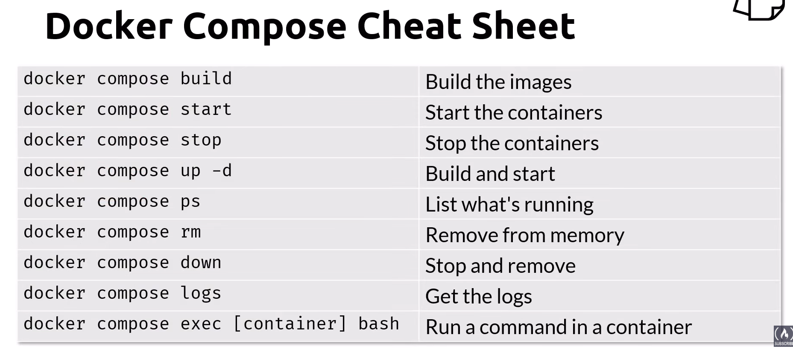

```!Notes:```
- docker compose build -f to specify the file location

## Compose V2
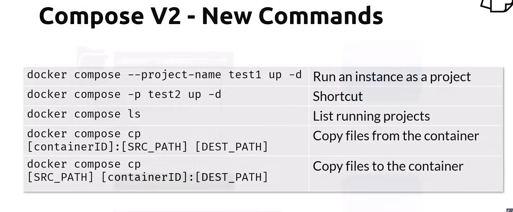

## Features

- Resource Limits:
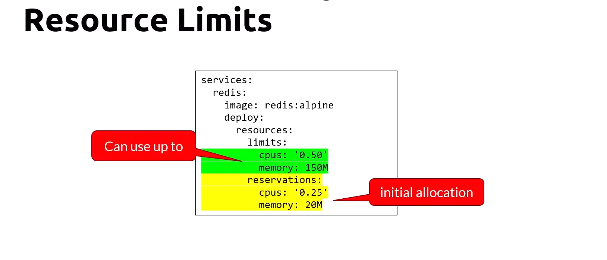

- Env Variables:
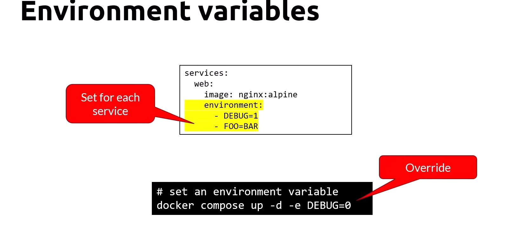
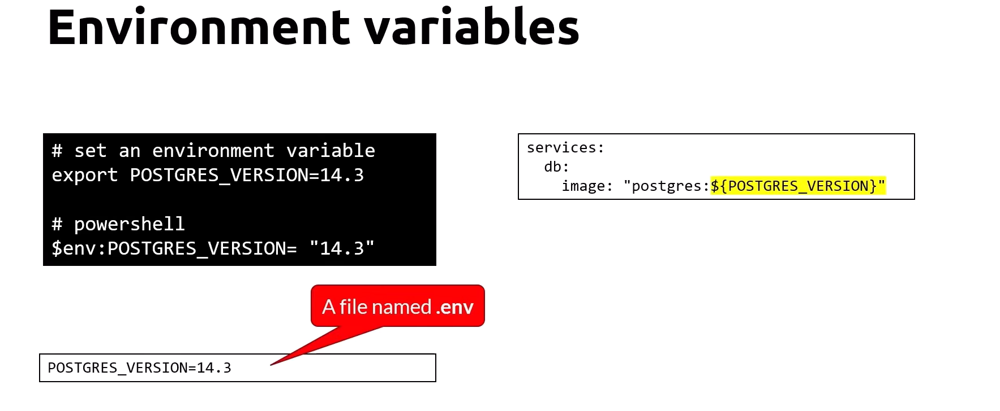

- Networking:
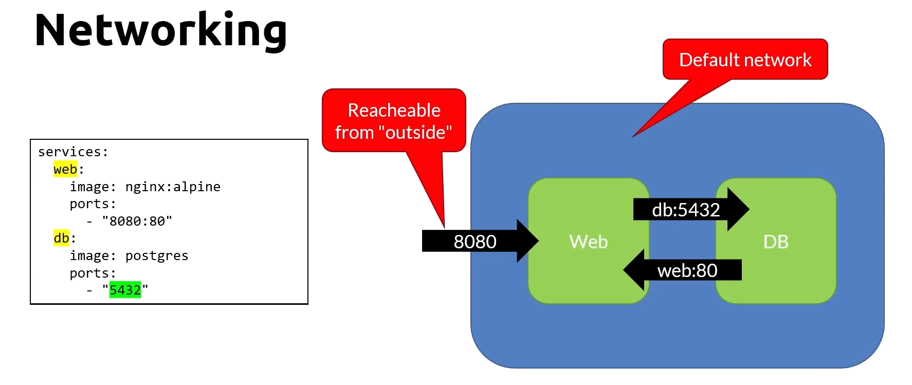
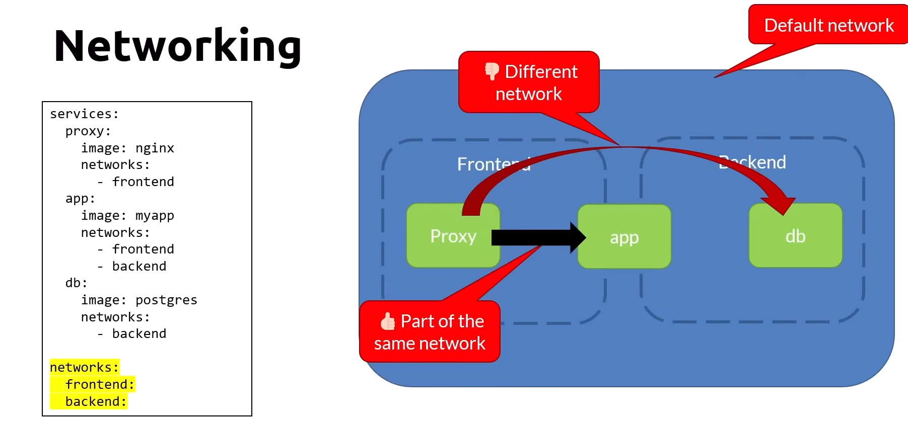

- Dependence:
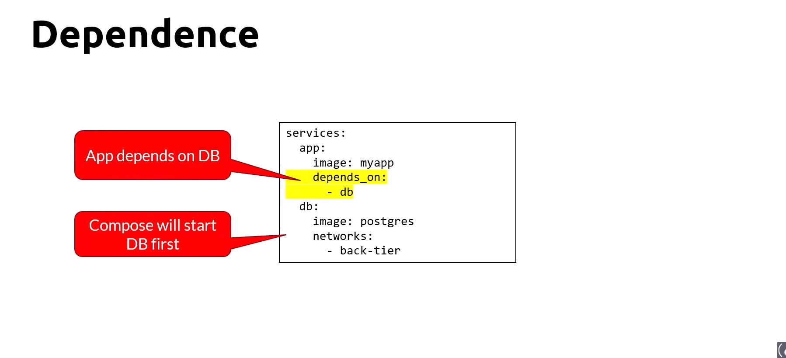

- Volumes - Named:
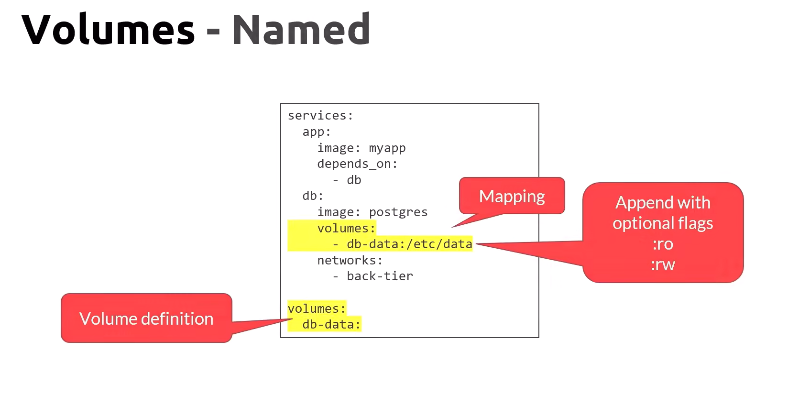
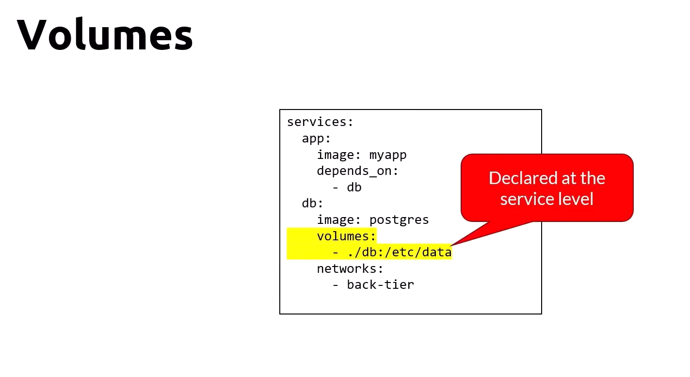

- Restart Policy:
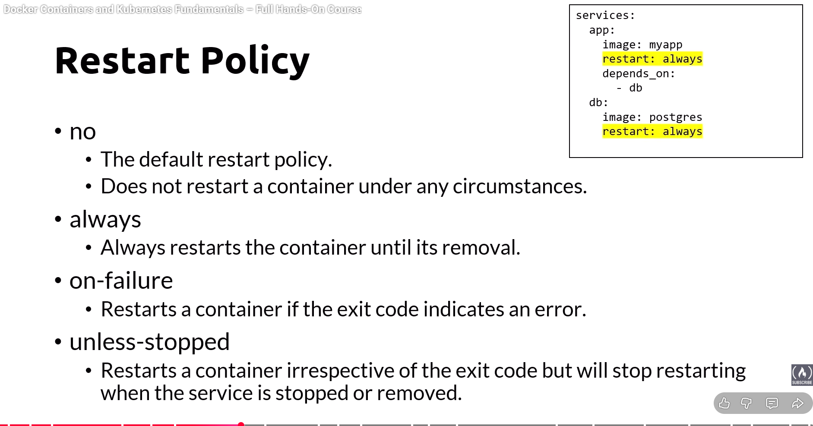