## Node Architecture
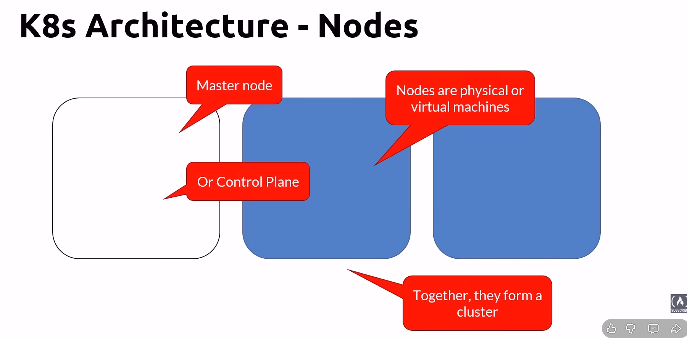

## 1. Master Node Architecture
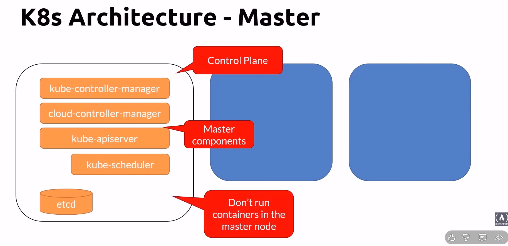
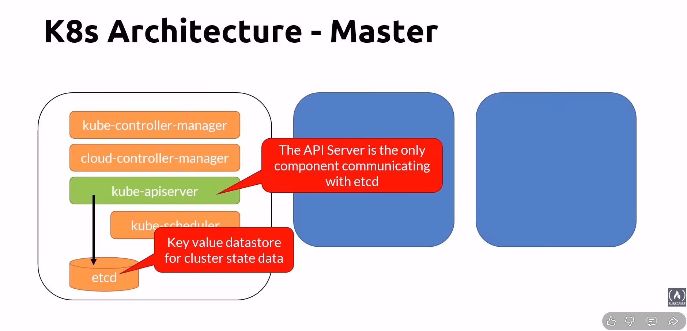

### kube-apiserver
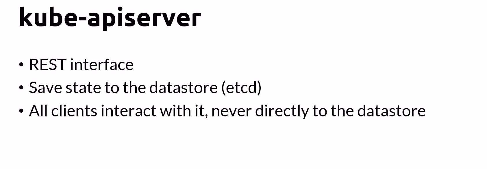

### etdc
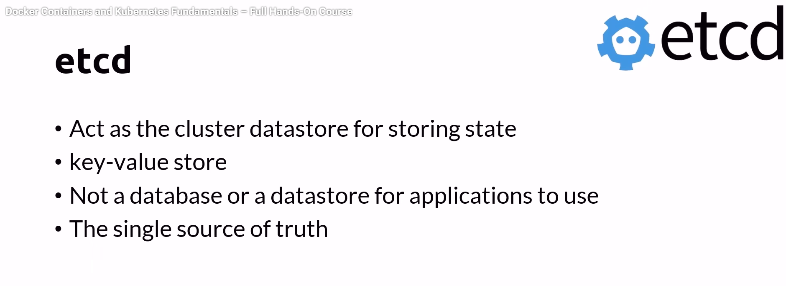

### kube-control-manager
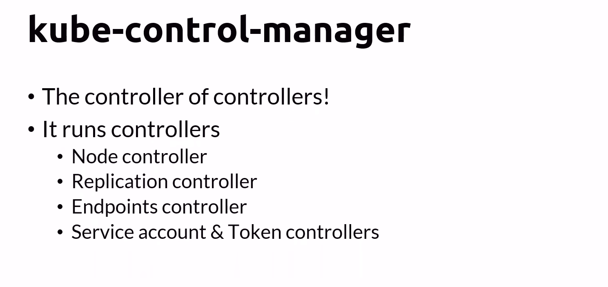

### cloud-control-manager
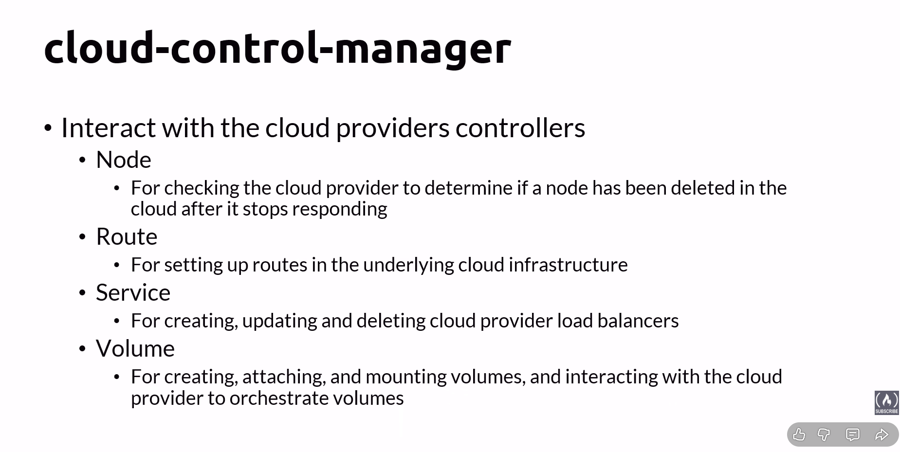

### kube-scheduler
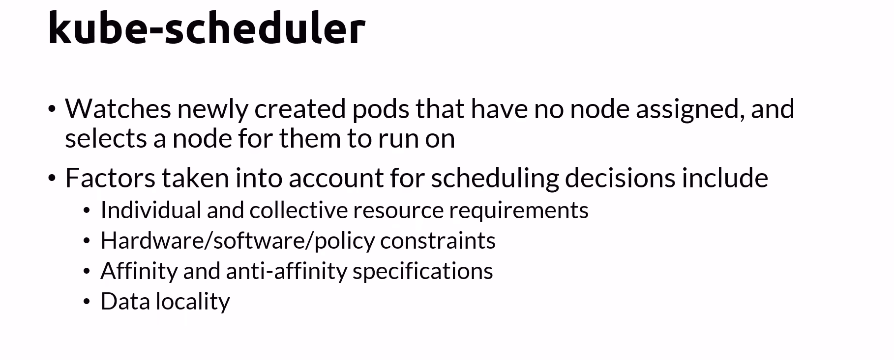

### Addons
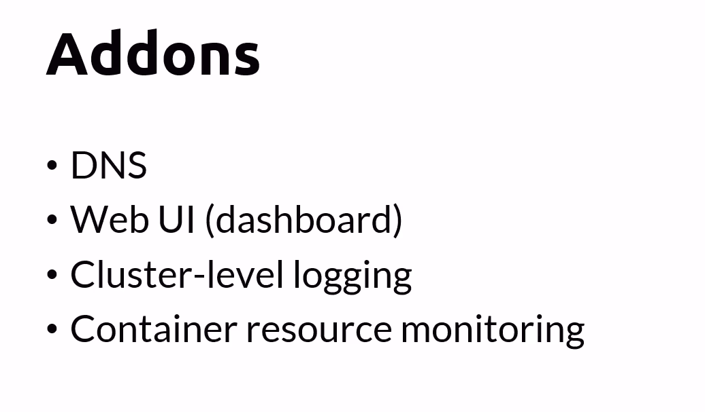

## 2.Worker Node
- Node running containers
 
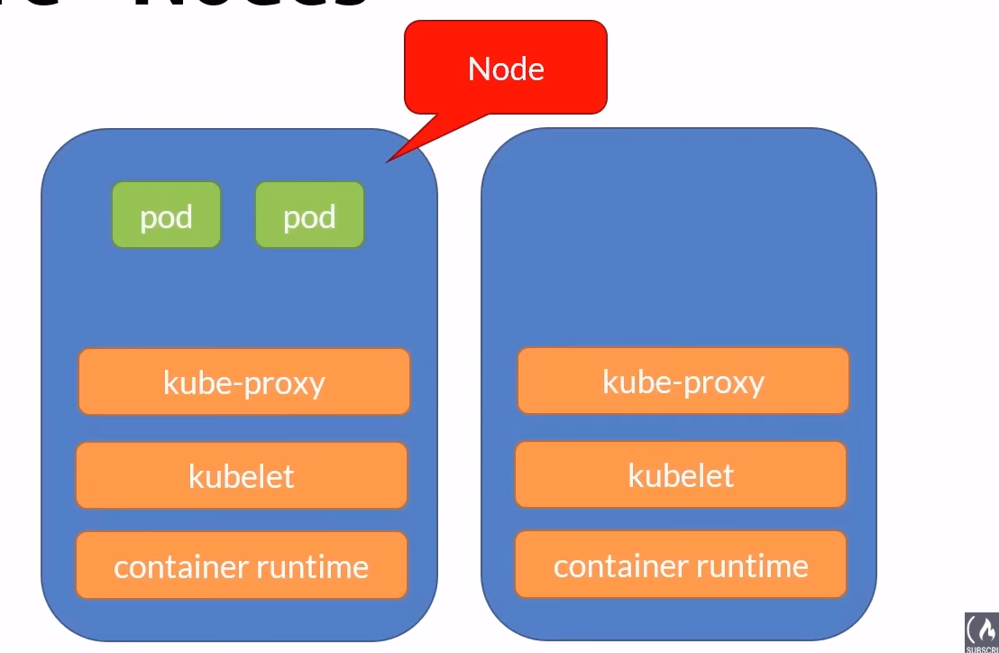

### kubelet
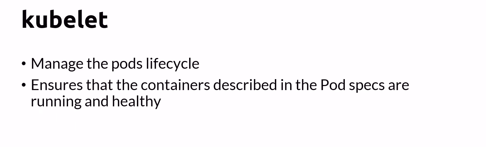

### kube-proxy
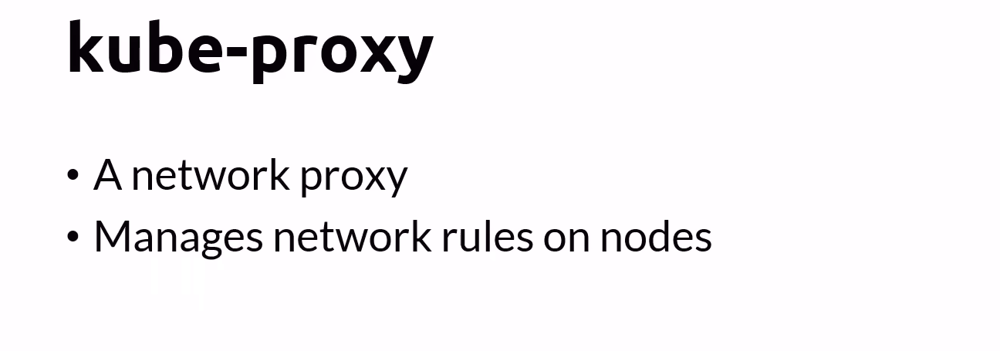

### container-runtime
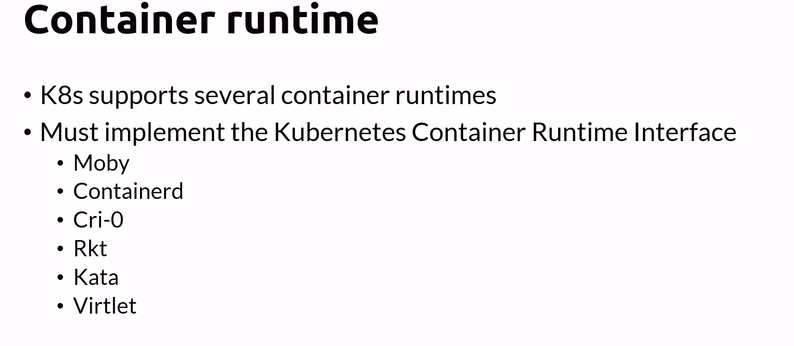
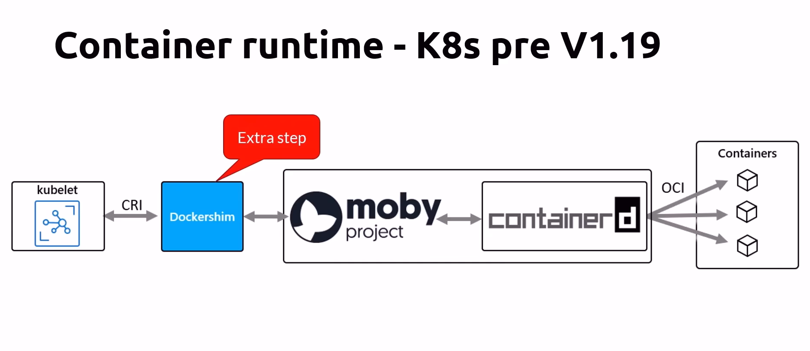
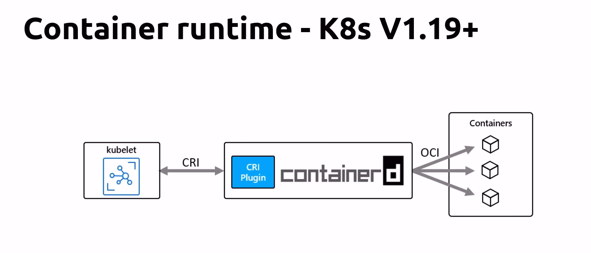
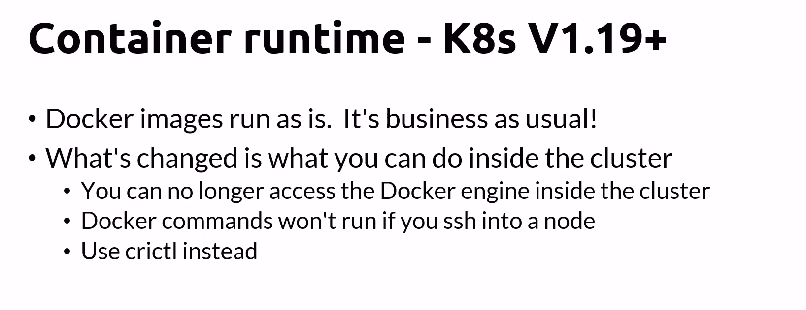

### Nodes pool
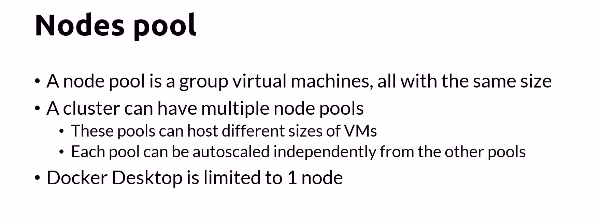
