## Workloads
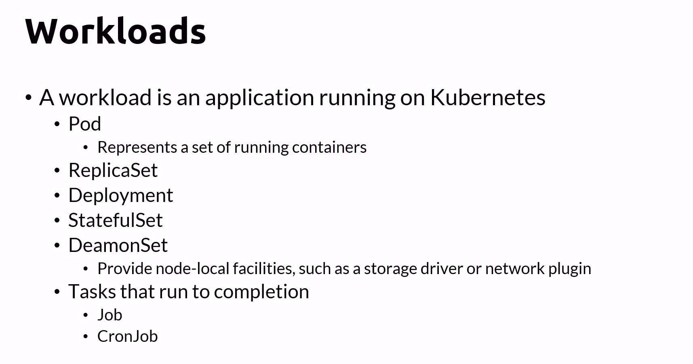

## ReplicaSets
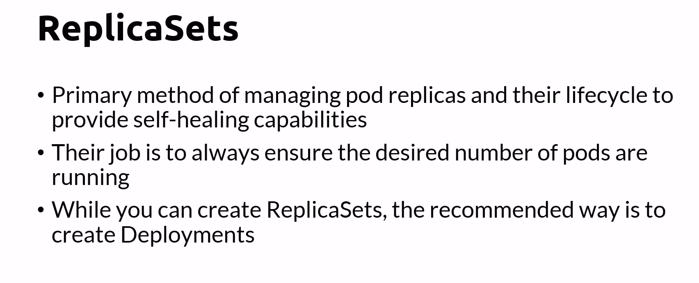

- Self-Healing: If a pod it crash, K8S will replace automatically with a new pod

- Example:
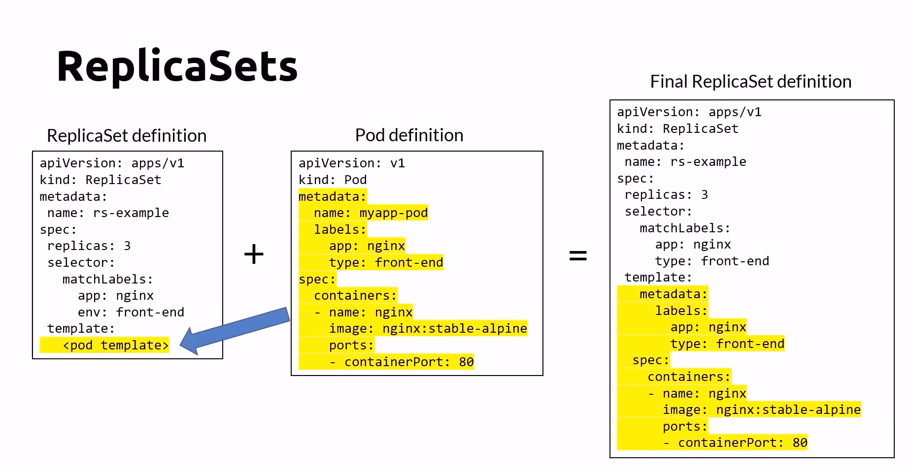
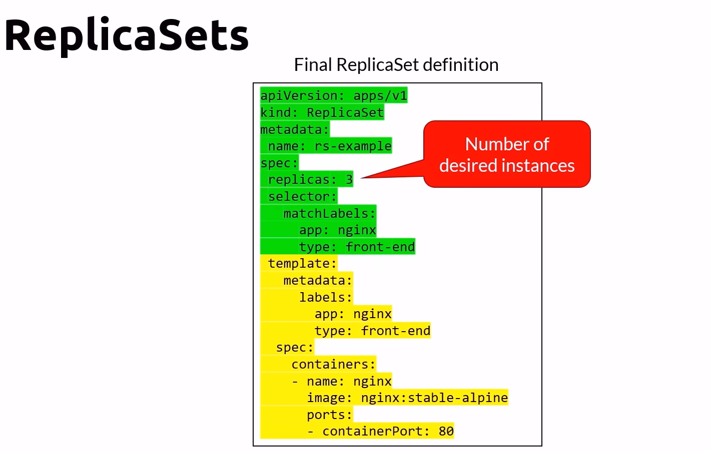

- CLI:
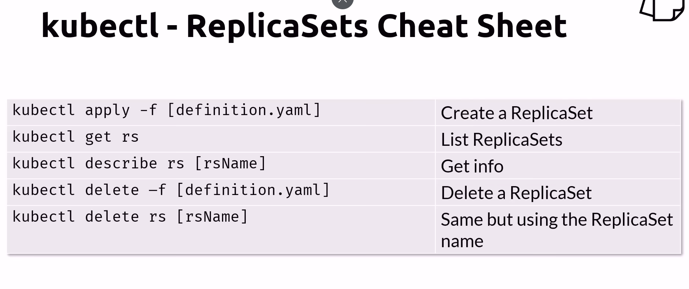

## Deployment
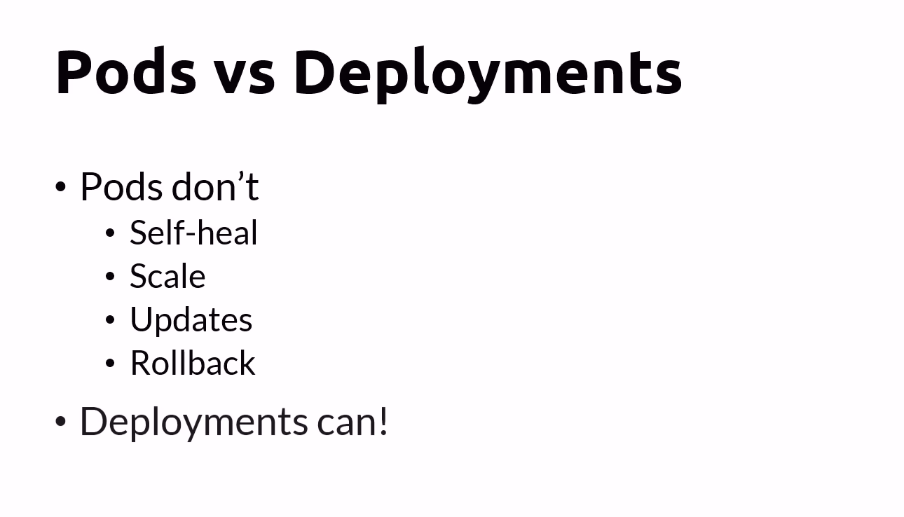

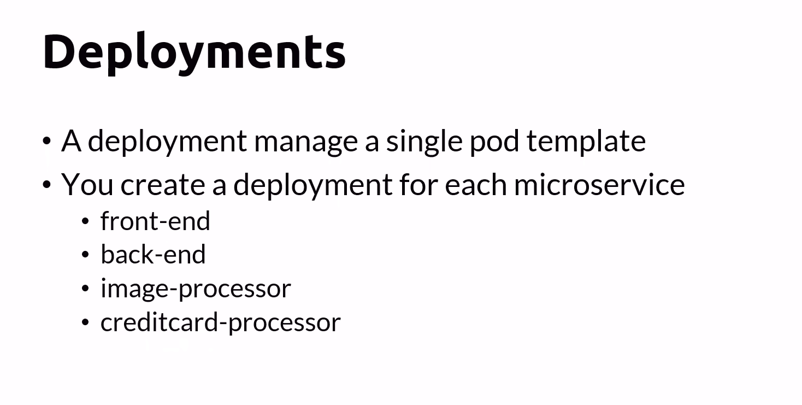

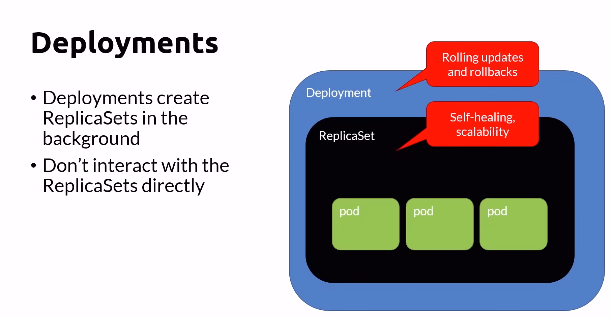

- Example: 
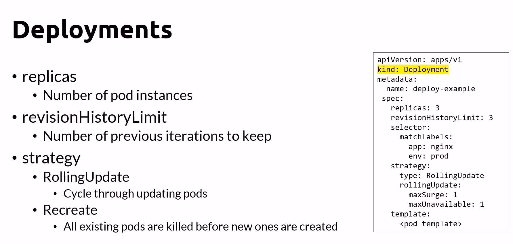

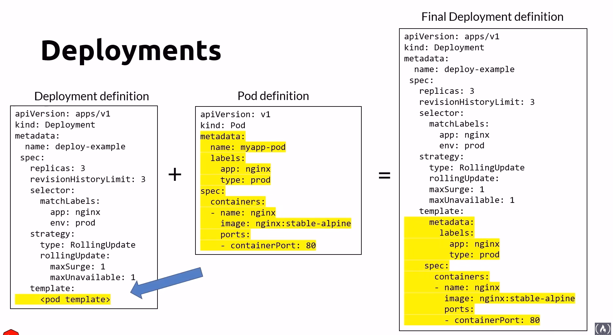

- Deployment cheatsheet
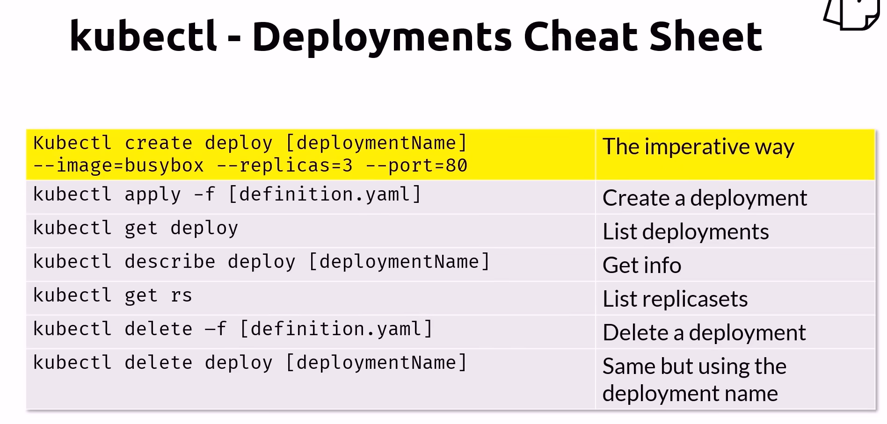

## DaemonSet
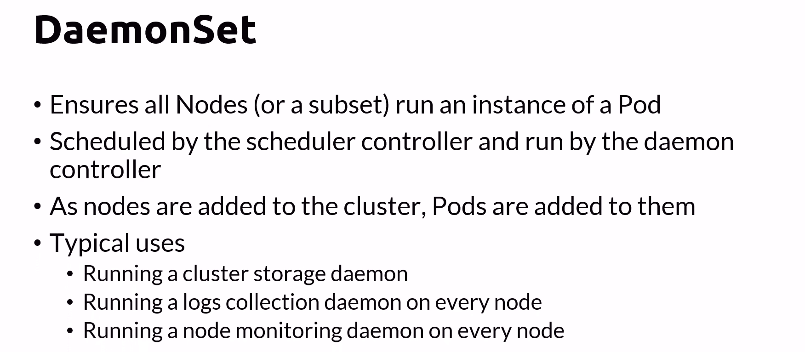

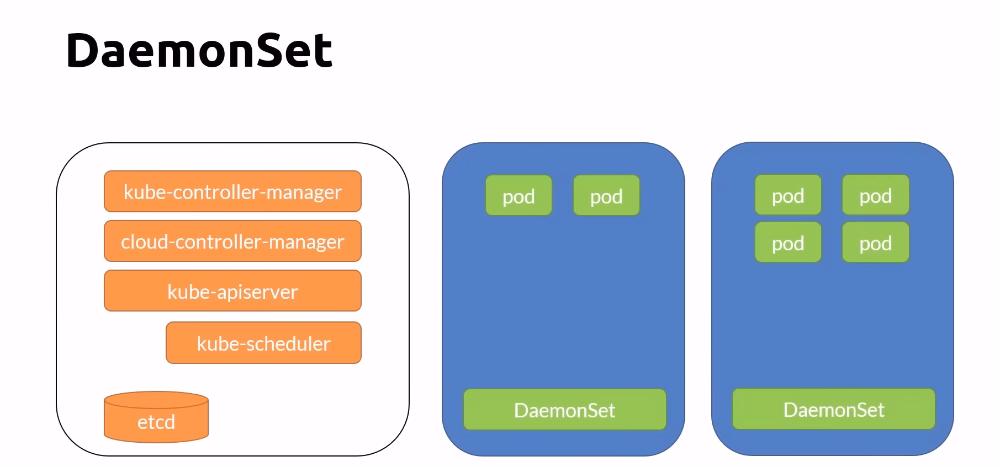

- Example:
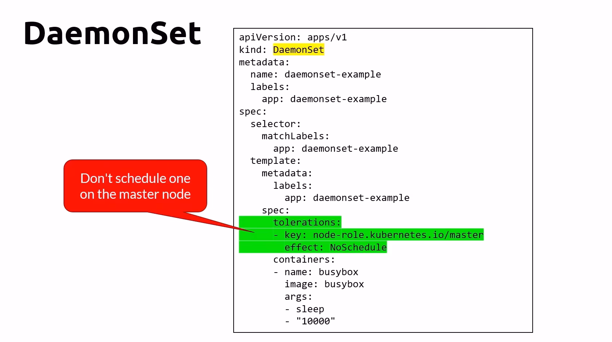

- Cheatsheet:
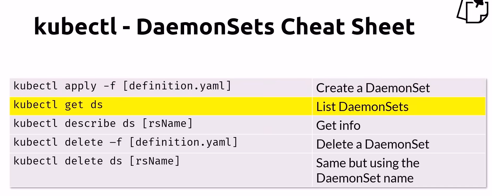

